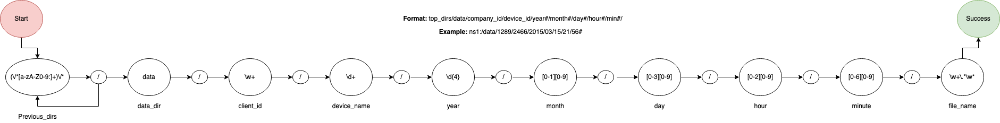

# Kentik Data Remover (Kremover)

This is a simple command line tool to remove client data when the retention period is over.

It supports:
 - Custom retention times for clients, also allows setting default retention times for all others
 - Running with different priority (setting nice value), so not starving other processes
 - Dryruns, see the files to delete without deleting
 - Verbosity for debugging. 
 - Automatic finding files/directories for removal. It doesn't touch other directories if formatting fails.
 - It validates the data structure and doesn't remove files if they do not conform to the structure

## Validations

 There are three validations done before a file/directory is removed
 - The directory structure should conform to the standard regex, such as `somedirs/data/year/month/day/hour/minute/`
 - The regex match is actually a Finite State Machine, only files runs through FSM is considered for next step.
 - FSM do not provide strict datetime guarantees, For example `month` regex [0-1][0-9] will allow `08` won't allow `20`.
   However this regex still allows `19` as a valid month. Next validation is done to validate datetime structure. 
 - Files validated in the previous step will be checked against retention period for that given client (or default 
   retention period if client does not have a custom retention policy)
 
> Finite State Machine diagram of directory structure (click for bigger view): 


## Installation

Make sure you have python3.6 or newer.

Clone repository:
```
git clone https://github.com/oneryalcin/kremover.git
```

Install
```
pip install -e .
```
> Note: `-e` is needed if you are oing to modify parameters such as `retention.json` or `constants` 
> otherwise you can omit `-e`
## Usage 

Verify the `kremover/constants.py` for value like default retention period (default 30 days).

Check non default client retentions `kremover/retentions/retentions.json` and modify if needed 

`kremover-console` is the tool for interacting 
```
$ kremover-console --help
usage: kremover-console [-h] --root-path ROOT_PATH [--set-nice SET_NICE]
                        [--verbose] [--dryrun]

Kentik File Remover

optional arguments:
  -h, --help            show this help message and exit
  --root-path ROOT_PATH
                        root path to search for deletion
  --set-nice SET_NICE   set the nice value, by default 10, it has less
                        priority over other running processes
  --verbose             set logging to DEBUG
  --dryrun              Don't delete, just show me marked for deletion
```

`kremover-console` needs at least `--root-path` parameter. 

Reference directory tree is below for examples below and client `999` 90 days of retention 


```
/tmp/data/
└── 999
    └── 1234
        ├── 2019
        │   ├── 08
        │   │   └── 11
        │   │       └── 09
        │   │           └── 56
        │   │               ├── very_old_1.bin
        │   │               ├── very_old_2.bin
        │   │               └── very_old_file_3
        │   ├── 09
        │   │   └── 07
        │   │       └── 01
        │   │           └── 04
        │   │               ├── old_file_1.bin
        │   │               └── old_file_2.txt
        │   └── 16
        │       └── 04
        │           └── 09
        │               └── 08
        │                   └── wrong_dated_directory.bin
        └── 2020
            └── 03
                └── 20
                    └── 23
                        ├── 15
                        │   └── recent1.bin
                        ├── 16
                        │   └── recent2.bin
                        └── wrong_file.bin
```

```

Running `kremover-console` removes all expired files

```bash
$ kremover-console --root-path=/tmp/data
2020-03-30 15:34:59,066 5714 kremover WARNING: Unlinking File /tmp/data/999/1234/2019/09/07/01/04/old_file_2.txt
2020-03-30 15:34:59,067 5714 kremover WARNING: Unlinking File /tmp/data/999/1234/2019/09/07/01/04/old_file_1.bin
2020-03-30 15:34:59,067 5714 kremover WARNING: Directory /tmp/data/999/1234/2019/09/07/01/04/old_file_1.bin is empty, removing
2020-03-30 15:34:59,068 5714 kremover WARNING: Directory /tmp/data/999/1234/2019/09/07/01/04 is empty, removing
2020-03-30 15:34:59,068 5714 kremover WARNING: Directory /tmp/data/999/1234/2019/09/07/01 is empty, removing
2020-03-30 15:34:59,068 5714 kremover WARNING: Directory /tmp/data/999/1234/2019/09/07 is empty, removing
2020-03-30 15:34:59,069 5714 kremover WARNING: Unlinking File /tmp/data/999/1234/2019/08/11/09/56/very_old_file_3
2020-03-30 15:34:59,069 5714 kremover WARNING: Unlinking File /tmp/data/999/1234/2019/08/11/09/56/very_old_1.bin
2020-03-30 15:34:59,069 5714 kremover WARNING: Unlinking File /tmp/data/999/1234/2019/08/11/09/56/very_old_2.bin
2020-03-30 15:34:59,070 5714 kremover WARNING: Directory /tmp/data/999/1234/2019/08/11/09/56/very_old_2.bin is empty, removing
2020-03-30 15:34:59,070 5714 kremover WARNING: Directory /tmp/data/999/1234/2019/08/11/09/56 is empty, removing
2020-03-30 15:34:59,070 5714 kremover WARNING: Directory /tmp/data/999/1234/2019/08/11/09 is empty, removing
2020-03-30 15:34:59,070 5714 kremover WARNING: Directory /tmp/data/999/1234/2019/08/11 is empty, removing
(venv3) mya03 (master *) KentikAssignment
``` 
 

### Dry Runs

Running `kremover-console` without `--dryrun` will remove all expired files and directories, this is irreversible. 
In order to verify which files would get purged without actually removing them use `--dryrun` 

```
$ kremover-console --root-path=/tmp/data --dryrun
[
  {
    "tstamp": "2019-09-07 01:04:00",
    "client": "999",
    "path": "/tmp/data/999/1234/2019/09/07/01/04/old_file_2.txt"
  },
  {
    "tstamp": "2019-09-07 01:04:00",
    "client": "999",
    "path": "/tmp/data/999/1234/2019/09/07/01/04/old_file_1.bin"
  },
  {
    "tstamp": "2019-08-11 09:56:00",
    "client": "999",
    "path": "/tmp/data/999/1234/2019/08/11/09/56/very_old_file_3"
  },
  {
    "tstamp": "2019-08-11 09:56:00",
    "client": "999",
    "path": "/tmp/data/999/1234/2019/08/11/09/56/very_old_1.bin"
  },
  {
    "tstamp": "2019-08-11 09:56:00",
    "client": "999",
    "path": "/tmp/data/999/1234/2019/08/11/09/56/very_old_2.bin"
  }
]
```

### Verbosity 

You can turn on verbosity `--verbose` flag. This will set the logging to `DEBUG`. By default logging is set to `WARNING`
This will help in debugging issues and also gives insight which files are not processed/ or processed. 

```
$ kremover-console --root-path=/tmp/data --dryrun --verbose
2020-03-30 16:24:50,882 20341 kremover DEBUG: Current process id: 20341, Nice value for PID 20341 is 10
2020-03-30 16:24:50,883 20341 kremover.validators.validators DEBUG: FSM template file /Users/mya03/dev/KentikAssignment/kremover/validators/kentik_dir_format read successful
2020-03-30 16:24:50,887 20341 kremover.validators.validators DEBUG:
---------VERIFYING DIRECTORY CONFORMITY TO TIMESTAMPS------------
2020-03-30 16:24:50,890 20341 kremover.validators.validators INFO: Object ['/tmp/', 'data/', '999', '1234', '2019', '16', '04', '09', '08', 'wrong_dated_directory.bin'] timestamp format check failed
2020-03-30 16:24:50,890 20341 kremover.validators.validators DEBUG: Object ['/tmp/', 'data/', '999', '1234', '2019', '09', '07', '01', '04', 'old_file_2.txt'] timestamp format check successful
2020-03-30 16:24:50,890 20341 kremover.validators.validators DEBUG: Object ['/tmp/', 'data/', '999', '1234', '2019', '09', '07', '01', '04', 'old_file_1.bin'] timestamp format check successful
2020-03-30 16:24:50,890 20341 kremover.validators.validators DEBUG: Object ['/tmp/', 'data/', '999', '1234', '2019', '08', '11', '09', '56', 'very_old_file_3'] timestamp format check successful
2020-03-30 16:24:50,890 20341 kremover.validators.validators DEBUG: Object ['/tmp/', 'data/', '999', '1234', '2019', '08', '11', '09', '56', 'very_old_1.bin'] timestamp format check successful
2020-03-30 16:24:50,890 20341 kremover.validators.validators DEBUG: Object ['/tmp/', 'data/', '999', '1234', '2019', '08', '11', '09', '56', 'very_old_2.bin'] timestamp format check successful
2020-03-30 16:24:50,890 20341 kremover.validators.validators DEBUG: Object ['/tmp/', 'data/', '999', '1234', '2020', '03', '20', '23', '16', 'recent2.bin'] timestamp format check successful
2020-03-30 16:24:50,891 20341 kremover.validators.validators DEBUG: Object ['/tmp/', 'data/', '999', '1234', '2020', '03', '20', '23', '15', 'recent1.bin'] timestamp format check successful
2020-03-30 16:24:50,891 20341 kremover.validators.validators DEBUG:
----VERIFYING DIRECTORY CONFORMITY TO TIMESTAMPS FINISHED--------
2020-03-30 16:24:50,891 20341 kremover.validators.validators DEBUG:
---------IDENTIFYING EXPIRED FILES FOR DELETION-------------
2020-03-30 16:24:50,891 20341 kremover.validators.validators INFO: File /tmp/data/999/1234/2019/09/07/01/04/old_file_2.txt is older (205 days) than 90, marked for deletion
2020-03-30 16:24:50,891 20341 kremover.validators.validators INFO: File /tmp/data/999/1234/2019/09/07/01/04/old_file_1.bin is older (205 days) than 90, marked for deletion
2020-03-30 16:24:50,891 20341 kremover.validators.validators INFO: File /tmp/data/999/1234/2019/08/11/09/56/very_old_file_3 is older (232 days) than 90, marked for deletion
2020-03-30 16:24:50,891 20341 kremover.validators.validators INFO: File /tmp/data/999/1234/2019/08/11/09/56/very_old_1.bin is older (232 days) than 90, marked for deletion
2020-03-30 16:24:50,891 20341 kremover.validators.validators INFO: File /tmp/data/999/1234/2019/08/11/09/56/very_old_2.bin is older (232 days) than 90, marked for deletion
2020-03-30 16:24:50,891 20341 kremover.validators.validators DEBUG: Keeping file /tmp/data/999/1234/2020/03/20/23/16/recent2.bin, retention: 90 days, 0:00:00 , age: 9
2020-03-30 16:24:50,891 20341 kremover.validators.validators DEBUG: Keeping file /tmp/data/999/1234/2020/03/20/23/15/recent1.bin, retention: 90 days, 0:00:00 , age: 9
2020-03-30 16:24:50,891 20341 kremover.validators.validators DEBUG:
-----IDENTIFYING EXPIRED FILES FOR DELETION COMPLETE--------
.. omiting output
```

if you look at logs closely, the line `['/tmp/', 'data/', '999', '1234', '2019', '16', '04', '09', '08', 'wrong_dated_directory.bin'] timestamp format check failed`
tells us `kremover-console` omitted this file as it fails to pass datetime directory structure. It make sense since month
value is `16`. 

Default retention period is 30 days but `kremover-console` successfully identified client `999` has a custom retention 
period. See the `retention` on this line: `Keeping file /tmp/data/999/1234/2020/03/20/23/16/recent2.bin, retention: 90 days, 0:00:00 , age: 9`

### Playing `nice` with other processes

`kremover-console` by default runs with lower priority (nice=10) therefore it does not starve other running processes. 
However you can change this value using `--set-nice` . In order to see `nice` value, you need to turn verbosity `--verbose`

```
$ kremover-console --root-path=/tmp/data --dryrun --verbose --set-nice=19
2020-03-30 16:37:01,031 20611 kremover DEBUG: Current process id: 20611, Nice value for PID 20611 is 19
.. omited output
``` 

## Setting custom retention period
Clients with custom retention period are defined in `kremover/retentions/retentions.json`. Add/Change/Remove 

```json
{
  "999": 90,
  "123": 45,
  "111": 60,
  "500": 30
}
```

`Client_ID` 999 has 90 days of retention. Default retention period is set at `kremover/constants.py`

```python
# ..

# Different clients may have different retention periods
# Default is 30 Days
RETENTION_DAYS_DEFAULT = 30

#..
```